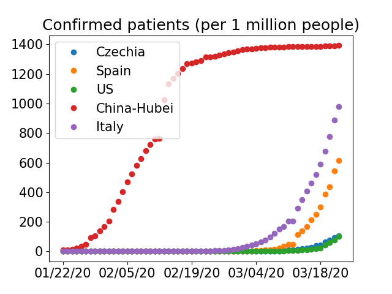

# Stats-Covid19
This repo tracks the impact of Covid19 on population of countries around the world, in particular Czechia, Spain, and the US.

<table border="0">
<td> 
<td> 
</table>

Notice that we show a normalized data with respect to the population of country or region.

It should help to better understand and predict the phase of spread, while compared to other
countries. Unfortunately, it seems that European countries will suffer from a higher death-rate compared to China.
The effect of population density is negligible.

